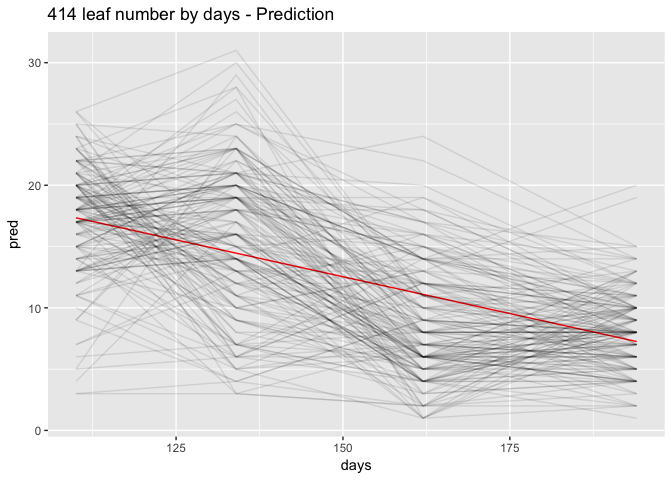

# 414 F2 Growth data(by days, not time)


Exploring 414 F2 growth data
- Summarizing and trying to set up growth models 


```r
data <- read_csv("F2_Phenotype_Bnapus_all.csv") # file that was output from "Format_Additional_414_data.Rmd"
head(data, n=3)
```

```
## # A tibble: 3 × 167
##            PHENOTYPE      ID_1     ID_2      ID_3      ID_4     ID_6
##                <chr>     <dbl>    <dbl>     <dbl>     <dbl>    <dbl>
## 1 Crude oil contents 38.855710 45.39054 37.693310 40.149150 36.93193
## 2      Caprylic acid  0.000000  0.00000  0.042328  0.036533  0.00000
## 3      Myristic acid  0.044349  0.00000  0.042328  0.036533  0.04343
## # ... with 161 more variables: ID_7 <dbl>, ID_8 <dbl>, ID_9 <dbl>,
## #   ID_10 <dbl>, ID_12 <dbl>, ID_13 <dbl>, ID_14 <dbl>, ID_15 <dbl>,
## #   ID_16 <dbl>, ID_17 <dbl>, ID_18 <dbl>, ID_19 <dbl>, ID_20 <dbl>,
## #   ID_21 <dbl>, ID_23 <dbl>, ID_24 <dbl>, ID_25 <dbl>, ID_26 <dbl>,
## #   ID_27 <dbl>, ID_28 <dbl>, ID_29 <dbl>, ID_30 <dbl>, ID_32 <dbl>,
## #   ID_34 <dbl>, ID_35 <dbl>, ID_36 <dbl>, ID_37 <dbl>, ID_38 <dbl>,
## #   ID_39 <dbl>, ID_40 <dbl>, ID_41 <dbl>, ID_42 <dbl>, ID_45 <dbl>,
## #   ID_47 <dbl>, ID_48 <dbl>, ID_49 <dbl>, ID_50 <dbl>, ID_51 <dbl>,
## #   ID_52 <dbl>, ID_53 <dbl>, ID_55 <dbl>, ID_56 <dbl>, ID_57 <dbl>,
## #   ID_58 <dbl>, ID_59 <dbl>, ID_60 <dbl>, ID_61 <dbl>, ID_62 <dbl>,
## #   ID_63 <dbl>, ID_64 <dbl>, ID_65 <dbl>, ID_67 <dbl>, ID_68 <dbl>,
## #   ID_69 <dbl>, ID_72 <dbl>, ID_73 <dbl>, ID_74 <dbl>, ID_75 <dbl>,
## #   ID_76 <dbl>, ID_77 <dbl>, ID_78 <dbl>, ID_79 <dbl>, ID_80 <dbl>,
## #   ID_81 <dbl>, ID_82 <dbl>, ID_84 <dbl>, ID_85 <dbl>, ID_86 <dbl>,
## #   ID_87 <dbl>, ID_88 <dbl>, ID_89 <dbl>, ID_90 <dbl>, ID_92 <dbl>,
## #   ID_94 <dbl>, ID_95 <dbl>, ID_96 <dbl>, ID_98 <dbl>, ID_99 <dbl>,
## #   ID_100 <dbl>, ID_101 <dbl>, ID_102 <dbl>, ID_107 <dbl>, ID_125 <dbl>,
## #   ID_142 <dbl>, ID_144 <dbl>, ID_148 <dbl>, ID_152 <dbl>, ID_153 <dbl>,
## #   ID_154 <dbl>, ID_155 <dbl>, ID_158 <dbl>, ID_160 <dbl>, ID_161 <dbl>,
## #   ID_163 <dbl>, ID_165 <dbl>, ID_166 <dbl>, ID_169 <dbl>, ID_170 <dbl>,
## #   ID_172 <dbl>, ID_174 <dbl>, ...
```

```r
sowing_date <- ymd("150909") # from "Additional F2 Data.xls"
```


```r
data.t <- as_tibble(t(data[,-1])) 
colnames(data.t) <- data$PHENOTYPE
data.t$ID <- colnames(data)[-1] 
data.t <- data.t %>% select(ID, everything())
head(data.t, n=3)
```

```
## # A tibble: 3 × 43
##      ID `Crude oil contents` `Caprylic acid` `Myristic acid`
##   <chr>                <dbl>           <dbl>           <dbl>
## 1  ID_1             38.85571        0.000000        0.044349
## 2  ID_2             45.39054        0.000000        0.000000
## 3  ID_3             37.69331        0.042328        0.042328
## # ... with 39 more variables: `Palmitic acid` <dbl>, `Palmitoliec
## #   aicd` <dbl>, `Heptadecanoic acid` <dbl>, `Stearic acid` <dbl>, `Oleic
## #   acid` <dbl>, `vaccenic acid` <dbl>, `Linoleic acid` <dbl>, `Arachidic
## #   acid` <dbl>, `cis-11-Eicosenoic acid` <dbl>, `Linolenic acid` <dbl>,
## #   `Behenic acid` <dbl>, `Erucic acid` <dbl>, `Weight of survey` <dbl>,
## #   `Weight of one thousand seeds` <dbl>, `Number of survey seeds` <dbl>,
## #   `No. of Transplanting plants` <dbl>, `No. of Survival plant` <dbl>,
## #   `Survival rate` <dbl>, lobe_number_2015.12.28 <dbl>,
## #   lobe_number_2016.01.21 <dbl>, lobe_number_2016.02.18 <dbl>,
## #   lobe_number_2016.03.21 <dbl>, leaf_number_2015.12.28 <dbl>,
## #   leaf_number_2016.01.21 <dbl>, leaf_number_2016.02.18 <dbl>,
## #   leaf_number_2016.03.21 <dbl>, plant_height_2016.05.13 <dbl>,
## #   plant_weight_2016.05.13 <dbl>, plant_width_2015.12.18 <dbl>,
## #   plant_width_2016.01.20 <dbl>, plant_width_2016.02.17 <dbl>,
## #   plant_width_2016.03.16 <dbl>, plant_height_2015.12.18 <dbl>,
## #   plant_height_2016.01.20 <dbl>, plant_height_2016.02.17 <dbl>,
## #   plant_height_2016.03.16 <dbl>, root_weight_2016.05.13 <dbl>,
## #   days.to.flower <dbl>, days.to.bolt <dbl>
```

```r
write_csv(data.t,"F2_Phenotype_Bnapus_formatted.csv") # will be kept for further analysis
```

### Leaf lobe phenotypes

(These are measured from leaves 5 and 8.  Shinje says these are always the same).

Criteria: at least 1cm long and when you fold it over touches petiole.

Important for distinguishing different varieties (patent, etc).

Characteristics of Plants Before Flowering
Leaf—development of lobes: The leaves on the upper portion of the stem can show varying degrees of development of lobes which are disconnected from one another along the petiole of the leaf. The degree of lobing is variety specific and can range from absent (no lobes)/weak through very strong (abundant lobes).
(US Patent US6489543)

Generally hight height number is good for drought tolerance.  Good for winter.  Not usually needed for summer, but good for summer in Mongolia.


```r
lobes <- data.t %>% select(ID, contains("lobe")) %>%
  gather(key=date, value=lobe_number, -ID) %>%
  mutate(date=str_replace(date, "lobe_number_","") %>% ymd() ) %>%
  mutate(days=date-sowing_date) %>%
  select(ID, days, lobe_number)
head(lobes)
```

```
## # A tibble: 6 × 3
##      ID     days lobe_number
##   <chr>   <time>       <dbl>
## 1  ID_1 110 days           0
## 2  ID_2 110 days           0
## 3  ID_3 110 days           0
## 4  ID_4 110 days           9
## 5  ID_6 110 days           0
## 6  ID_7 110 days           0
```

Plot & Modeling


```r
lobes %>% ggplot(aes(x=days, y=lobe_number, group=ID)) +
  geom_line(alpha=.1) + 
  ggtitle("414 lobe number by days - Full Data")
```

<!-- -->

```r
# predictions
lobes.mod <- lm(lobe_number ~ days, data = lobes)
summary(lobes.mod)
```

```
## 
## Call:
## lm(formula = lobe_number ~ days, data = lobes)
## 
## Residuals:
##    Min     1Q Median     3Q    Max 
## -8.063 -2.104 -1.104  1.937 15.472 
## 
## Coefficients:
##               Estimate Std. Error t value Pr(>|t|)    
## (Intercept) -12.390979   0.713804  -17.36   <2e-16 ***
## days          0.126261   0.004658   27.11   <2e-16 ***
## ---
## Signif. codes:  0 '***' 0.001 '**' 0.01 '*' 0.05 '.' 0.1 ' ' 1
## 
## Residual standard error: 3.765 on 662 degrees of freedom
## Multiple R-squared:  0.5261,	Adjusted R-squared:  0.5253 
## F-statistic: 734.8 on 1 and 662 DF,  p-value: < 2.2e-16
```

```r
lobes %>%
  add_predictions(lobes.mod) %>%
  ggplot() +
  geom_line(aes(x=days, y = pred), colour = "red", size = 3/4) +
  geom_line(data=lobes, aes(x=days, y = lobe_number, group=ID), alpha=0.1) +
  ggtitle("414 lobe number by days - Prediction")
```

<!-- -->

```r
# residuals
lobes %>%
  add_residuals(lobes.mod) %>%
  ggplot(aes(days, resid)) +
  geom_point(aes(), alpha=0.2) +
  geom_smooth(se = FALSE) +
  geom_hline(yintercept = 0, colour = "red", linetype = 2, size = 0.5)
```

<!-- -->

```r
  ggtitle("414 lobe number by days - Residuals")
```

```
## $title
## [1] "414 lobe number by days - Residuals"
## 
## $subtitle
## NULL
## 
## attr(,"class")
## [1] "labels"
```

```r
# Despite the low R-squared value, the residual plot appears to show fairly random noises, indicating that this model did not capture the pattern of the data set not so badly.
```

```r
# create a dataframe with lobe_number=0 at time=0(sowing date)
lobes0 <- lobes %>% 
  data.frame() %>% #copy lobes
  filter(days=="110") %>% # to filter unique IDs
  mutate(days=0, lobe_number=0) %>% 
  rbind(lobes) 
head(lobes0) # data frame including data at time=0
```

```
##     ID days lobe_number
## 1 ID_1    0           0
## 2 ID_2    0           0
## 3 ID_3    0           0
## 4 ID_4    0           0
## 5 ID_6    0           0
## 6 ID_7    0           0
```

```r
lobes0 %>% ggplot(aes(x=days, y=lobe_number, group=ID)) +
  geom_line(alpha=.1) + 
  ggtitle("414 lobe number by days - Full Data")
```

<!-- -->

```r
# predictions
lobes0.mod <- lm(lobe_number ~ days, data = lobes0)
summary(lobes0.mod)
```

```
## 
## Call:
## lm(formula = lobe_number ~ days, data = lobes0)
## 
## Residuals:
##    Min     1Q Median     3Q    Max 
## -7.695 -4.654  1.305  1.943 13.943 
## 
## Coefficients:
##             Estimate Std. Error t value Pr(>|t|)    
## (Intercept) -1.77866    0.28508  -6.239 7.02e-10 ***
## days         0.05848    0.00208  28.115  < 2e-16 ***
## ---
## Signif. codes:  0 '***' 0.001 '**' 0.01 '*' 0.05 '.' 0.1 ' ' 1
## 
## Residual standard error: 3.969 on 828 degrees of freedom
## Multiple R-squared:  0.4884,	Adjusted R-squared:  0.4878 
## F-statistic: 790.5 on 1 and 828 DF,  p-value: < 2.2e-16
```

```r
lobes0 %>%
  add_predictions(lobes0.mod) %>%
  ggplot() +
  geom_line(aes(x=days, y = pred), colour = "red", size = 3/4) +
  geom_line(data=lobes0, aes(x=days, y = lobe_number, group=ID), alpha=0.1) +
  ggtitle("414 lobe number by days - Prediction")
```

<!-- -->

```r
# residuals
lobes0 %>%
  add_residuals(lobes0.mod) %>%
  ggplot(aes(days, resid)) +
  geom_line(aes(group=ID), alpha=0.2) +
  geom_smooth(se = FALSE) +
  geom_hline(yintercept = 0, colour = "red", linetype = 2, size = 0.5)
```

<!-- -->

```r
  ggtitle("414 lobe number by days - Residuals")
```

```
## $title
## [1] "414 lobe number by days - Residuals"
## 
## $subtitle
## NULL
## 
## attr(,"class")
## [1] "labels"
```

```r
# Not improved compared to previous analysis
```


### Leaf number phenotypes


```r
leafs <- data.t %>% select(ID, contains("leaf")) %>%
  gather(key=date, value=leaf_number, -ID) %>%
  mutate(date=str_replace(date, "leaf_number_","") %>% ymd() ) %>%
  mutate(days=date-sowing_date) %>%
  select(ID, days, leaf_number)
head(leafs)
```

```
## # A tibble: 6 × 3
##      ID     days leaf_number
##   <chr>   <time>       <dbl>
## 1  ID_1 110 days          24
## 2  ID_2 110 days          19
## 3  ID_3 110 days          15
## 4  ID_4 110 days          22
## 5  ID_6 110 days          13
## 6  ID_7 110 days          21
```


Plot & Modeling


```r
leafs %>% ggplot(aes(x=days, y=leaf_number,group=ID)) +
  geom_line(alpha=.1) + 
  ggtitle("414 lobe number by days - Full Data")
```

```
## Don't know how to automatically pick scale for object of type difftime. Defaulting to continuous.
```

<!-- -->

```r
# predictions
leafs.mod <- lm(leaf_number ~ days, data = leafs)
summary(leafs.mod)
```

```
## 
## Call:
## lm(formula = leaf_number ~ days, data = leafs)
## 
## Residuals:
##      Min       1Q   Median       3Q      Max 
## -14.3452  -3.2494   0.5393   3.5393  16.5393 
## 
## Coefficients:
##             Estimate Std. Error t value Pr(>|t|)    
## (Intercept) 30.56586    0.94698   32.28   <2e-16 ***
## days        -0.12019    0.00618  -19.45   <2e-16 ***
## ---
## Signif. codes:  0 '***' 0.001 '**' 0.01 '*' 0.05 '.' 0.1 ' ' 1
## 
## Residual standard error: 4.995 on 662 degrees of freedom
## Multiple R-squared:  0.3636,	Adjusted R-squared:  0.3627 
## F-statistic: 378.3 on 1 and 662 DF,  p-value: < 2.2e-16
```

```r
leafs %>% 
  add_predictions(leafs.mod) %>%
  ggplot() +
  geom_line(aes(x=days, y = pred), colour = "red", size = 0.5) +
  geom_line(data=leafs, aes(x=days, y=leaf_number, group=ID), alpha=.1) +
  ggtitle("414 leaf number by days - Prediction")
```

```
## Don't know how to automatically pick scale for object of type difftime. Defaulting to continuous.
```

<!-- -->

```r
# residuals
leafs %>%
  add_residuals(leafs.mod) %>%
  ggplot(aes(days, resid)) +
  geom_point(alpha=0.2) +
  geom_smooth(se = FALSE) +
  geom_hline(yintercept = 0, colour = "red", linetype = 2, size = 0.5) +
  ggtitle("414 leaf number by date - Residuals")
```

```
## Don't know how to automatically pick scale for object of type difftime. Defaulting to continuous.
```

```
## `geom_smooth()` using method = 'loess'
```

```
## Warning in simpleLoess(y, x, w, span, degree = degree, parametric =
## parametric, : pseudoinverse used at 109.58
```

```
## Warning in simpleLoess(y, x, w, span, degree = degree, parametric =
## parametric, : neighborhood radius 52.42
```

```
## Warning in simpleLoess(y, x, w, span, degree = degree, parametric =
## parametric, : reciprocal condition number 1.657e-15
```

```
## Warning in simpleLoess(y, x, w, span, degree = degree, parametric =
## parametric, : There are other near singularities as well. 3650.6
```

<!-- -->

```r
# Despite the low R-squared value, the residual plot appears to show fairly random noises, indicating that this model did not capture the pattern of the data set not so badly.
```

```r
# create a dataframe with leaf_number=0 at time=0(sowing date)
leafs0 <- leafs %>% 
  data.frame() %>% #copy lobes
  filter(days=="110") %>% # to filter unique IDs
  mutate(days=0, leaf_number=0) %>% 
  rbind(leafs) 
head(leafs0) # data frame including data at time=0
```

```
##     ID days leaf_number
## 1 ID_1    0           0
## 2 ID_2    0           0
## 3 ID_3    0           0
## 4 ID_4    0           0
## 5 ID_6    0           0
## 6 ID_7    0           0
```

```r
leafs0 %>% ggplot(aes(x=days, y=leaf_number,group=ID)) +
  geom_line(alpha=.1) + 
  ggtitle("414 lobe number by days - Full Data")
```

<!-- -->

```r
# predictions
leafs0.mod <- lm(leaf_number ~ days, data = leafs0)
summary(leafs0.mod)
```

```
## 
## Call:
## lm(formula = leaf_number ~ days, data = leafs0)
## 
## Residuals:
##     Min      1Q  Median      3Q     Max 
## -12.510  -4.388  -3.005   5.440  20.312 
## 
## Coefficients:
##             Estimate Std. Error t value Pr(>|t|)    
## (Intercept) 4.387572   0.491567   8.926   <2e-16 ***
## days        0.047021   0.003586  13.111   <2e-16 ***
## ---
## Signif. codes:  0 '***' 0.001 '**' 0.01 '*' 0.05 '.' 0.1 ' ' 1
## 
## Residual standard error: 6.844 on 828 degrees of freedom
## Multiple R-squared:  0.1719,	Adjusted R-squared:  0.1709 
## F-statistic: 171.9 on 1 and 828 DF,  p-value: < 2.2e-16
```

```r
leafs0 %>% 
  add_predictions(leafs0.mod) %>%
  ggplot() +
  geom_line(aes(x=days, y = pred), colour = "red", size = 0.5) +
  geom_line(data=leafs0, aes(x=days, y=leaf_number, group=ID), alpha=.1) +
  ggtitle("414 leaf number by days - Prediction")
```

<!-- -->

```r
# residuals
leafs0 %>%
  add_residuals(leafs0.mod) %>%
  ggplot(aes(days, resid)) +
  geom_point(alpha=0.2) +
  geom_smooth(se = FALSE) +
  geom_hline(yintercept = 0, colour = "red", linetype = 2, size = 0.5) +
  ggtitle("414 leaf number by date - Residuals")
```

```
## `geom_smooth()` using method = 'loess'
```

<!-- -->

```r
# Failed to the pattern of the data set - low R-squared value and non-random distributed noises.
```


## Plant height phenotypes


```r
heights <- data.t %>% select(ID, contains("height")) %>%
  gather(key=date, value=height, -ID) %>%
  mutate(date=str_replace(date, "plant_height_","") %>% ymd() ) %>%
  mutate(days=date-sowing_date) %>%
  select(ID, days, height)
head(heights)
```

```
## # A tibble: 6 × 3
##      ID     days height
##   <chr>   <time>  <dbl>
## 1  ID_1 247 days    221
## 2  ID_2 247 days    212
## 3  ID_3 247 days    149
## 4  ID_4 247 days    182
## 5  ID_6 247 days    229
## 6  ID_7 247 days    172
```

Plot & Modeling


```r
heights %>% ggplot(aes(x=days, y=height, group=ID)) +
  geom_line(alpha=.1) + 
  ggtitle("414 height by days - Full Data")
```

```
## Don't know how to automatically pick scale for object of type difftime. Defaulting to continuous.
```

<!-- -->

```r
heights.mod <- lm(height ~ days, data = heights)
coef(heights.mod)
```

```
## (Intercept)        days 
##  -87.164116    1.085036
```

```r
# predictions
heights.mod <- lm(height ~ days, data = heights)
summary(heights.mod)
```

```
## 
## Call:
## lm(formula = height ~ days, data = heights)
## 
## Residuals:
##      Min       1Q   Median       3Q      Max 
## -107.840  -15.146   -4.683   19.092   76.092 
## 
## Coefficients:
##              Estimate Std. Error t value Pr(>|t|)    
## (Intercept) -87.16412    3.18263  -27.39   <2e-16 ***
## days          1.08504    0.01835   59.12   <2e-16 ***
## ---
## Signif. codes:  0 '***' 0.001 '**' 0.01 '*' 0.05 '.' 0.1 ' ' 1
## 
## Residual standard error: 26.5 on 828 degrees of freedom
## Multiple R-squared:  0.8085,	Adjusted R-squared:  0.8082 
## F-statistic:  3495 on 1 and 828 DF,  p-value: < 2.2e-16
```

```r
heights %>% 
  add_predictions(heights.mod) %>%
  ggplot() +
  geom_line(aes(x=days, y = pred), colour = "red", size = 0.5) +
  geom_line(data=heights, aes(x=days, y=height, group=ID), alpha=.1) +
  ggtitle("414 height by days - Prediction")
```

```
## Don't know how to automatically pick scale for object of type difftime. Defaulting to continuous.
```

<!-- -->

```r
# residuals
heights %>%
  add_residuals(heights.mod) %>%
  ggplot(aes(days, resid)) +
  geom_point(alpha=0.2) +
  geom_smooth(se = FALSE) +
  geom_hline(yintercept = 0, colour = "red", linetype = 2, size = 0.5) +
  ggtitle("414 height by days - Residuals")
```

```
## Don't know how to automatically pick scale for object of type difftime. Defaulting to continuous.
```

```
## `geom_smooth()` using method = 'loess'
```

<!-- -->

```r
# Despite not so low R-squared value, the residual plot appears not to show  random noises, indicating that this model needs to be improved.  
```


```r
# To create a dataframe with height=0 at time=0(sowing date)
heights0 <- heights %>% 
  data.frame() %>% #copy heights
  filter(days=="247") %>% #filter unique IDs
  mutate(days=0, height=0) %>% 
  rbind(heights) 
head(heights0) #data frame including data at time=0
```

```
##     ID days height
## 1 ID_1    0      0
## 2 ID_2    0      0
## 3 ID_3    0      0
## 4 ID_4    0      0
## 5 ID_6    0      0
## 6 ID_7    0      0
```

```r
heights0 %>% ggplot(aes(x=days, y=height, group=ID)) +
  geom_line(alpha=.1) + 
  ggtitle("414 height by days - Full Data")
```

<!-- -->

```r
heights0.mod <- lm(height ~ days, data = heights0)
coef(heights0.mod)
```

```
## (Intercept)        days 
## -25.6822113   0.7456052
```

```r
# predictions
heights0.mod <- lm(height ~ days, data = heights0)
summary(heights0.mod)
```

```
## 
## Call:
## lm(formula = height ~ days, data = heights0)
## 
## Residuals:
##     Min      1Q  Median      3Q     Max 
## -85.482 -31.391   5.579  25.682  78.763 
## 
## Coefficients:
##              Estimate Std. Error t value Pr(>|t|)    
## (Intercept) -25.68221    2.01856  -12.72   <2e-16 ***
## days          0.74561    0.01275   58.47   <2e-16 ***
## ---
## Signif. codes:  0 '***' 0.001 '**' 0.01 '*' 0.05 '.' 0.1 ' ' 1
## 
## Residual standard error: 30.97 on 994 degrees of freedom
## Multiple R-squared:  0.7747,	Adjusted R-squared:  0.7745 
## F-statistic:  3419 on 1 and 994 DF,  p-value: < 2.2e-16
```

```r
heights0 %>% 
  add_predictions(heights0.mod) %>%
  ggplot() +
  geom_line(aes(x=days, y = pred), colour = "red", size = 0.5) +
  geom_line(data=heights0, aes(x=days, y=height, group=ID), alpha=.1) +
  ggtitle("414 height by days - Prediction")
```

<!-- -->

```r
# residuals
heights0 %>%
  add_residuals(heights0.mod) %>%
  ggplot(aes(days, resid)) +
  geom_point(alpha=0.2) +
  geom_smooth(se = FALSE) +
  geom_hline(yintercept = 0, colour = "red", linetype = 2, size = 0.5) +
  ggtitle("414 height by days - Residuals")
```

```
## `geom_smooth()` using method = 'loess'
```

<!-- -->

```r
# It doesn't like random noise, suggesting the model has not done a good job capturing in the dataset.
```


## Plant width phenotypes


```r
widths <- data.t %>% select(ID, contains("width")) %>%
  gather(key=date, value=width, -ID) %>%
  mutate(date=str_replace(date, "plant_width_","") %>% ymd() ) %>%
  mutate(days=date-sowing_date) %>%
  select(ID, days, width)
head(widths)
```

```
## # A tibble: 6 × 3
##      ID     days width
##   <chr>   <time> <dbl>
## 1  ID_1 100 days  46.5
## 2  ID_2 100 days  42.5
## 3  ID_3 100 days  23.0
## 4  ID_4 100 days  63.5
## 5  ID_6 100 days  28.5
## 6  ID_7 100 days  49.5
```


 
Plot & Modeling


```r
widths %>% ggplot(aes(x=days, y=width,group=ID)) +
  geom_line(alpha=.1) + ggtitle("414 width by days")
```

```
## Don't know how to automatically pick scale for object of type difftime. Defaulting to continuous.
```

<!-- -->

```r
# predictions
widths.mod <- lm(width ~ days, data = widths)
summary(widths.mod)
```

```
## 
## Call:
## lm(formula = width ~ days, data = widths)
## 
## Residuals:
##     Min      1Q  Median      3Q     Max 
## -36.051  -7.404   0.309   8.309  39.596 
## 
## Coefficients:
##             Estimate Std. Error t value Pr(>|t|)    
## (Intercept) 23.76235    1.97889   12.01   <2e-16 ***
## days         0.20142    0.01324   15.21   <2e-16 ***
## ---
## Signif. codes:  0 '***' 0.001 '**' 0.01 '*' 0.05 '.' 0.1 ' ' 1
## 
## Residual standard error: 11.26 on 662 degrees of freedom
## Multiple R-squared:  0.259,	Adjusted R-squared:  0.2579 
## F-statistic: 231.4 on 1 and 662 DF,  p-value: < 2.2e-16
```

```r
widths %>% 
  add_predictions(widths.mod) %>%
  ggplot() +
  geom_line(aes(x=days, y = pred), colour = "red", size = 0.5) +
  geom_line(data=widths, aes(x=days, y=width, group=ID), alpha=.1) +
  ggtitle("414 width by days - Prediction")
```

```
## Don't know how to automatically pick scale for object of type difftime. Defaulting to continuous.
```

<!-- -->

```r
# Residuals
widths %>%
  add_residuals(widths.mod) %>%
  ggplot(aes(days, resid)) +
  geom_point(alpha=0.2) +
  geom_smooth(se = FALSE) +
  geom_hline(yintercept = 0, colour = "red", linetype =2, size = 0.5) +
  ggtitle("414 width by days - Residuals")
```

```
## Don't know how to automatically pick scale for object of type difftime. Defaulting to continuous.
```

```
## `geom_smooth()` using method = 'loess'
```

```
## Warning in simpleLoess(y, x, w, span, degree = degree, parametric =
## parametric, : pseudoinverse used at 99.555
```

```
## Warning in simpleLoess(y, x, w, span, degree = degree, parametric =
## parametric, : neighborhood radius 61.445
```

```
## Warning in simpleLoess(y, x, w, span, degree = degree, parametric =
## parametric, : reciprocal condition number 1.8457e-15
```

```
## Warning in simpleLoess(y, x, w, span, degree = degree, parametric =
## parametric, : There are other near singularities as well. 3186
```

<!-- -->

```r
# Despite the very low R-squared value, the residual plot seems to show the fairly random distribution of noises.   
```

```r
# To create a dataframe with width=0 at time=0(sowing date)
widths0 <- widths %>% 
  data.frame() %>% #copy widths
  filter(days=="100") %>% #filter unique IDs
  mutate(days=0, width=0) %>% 
  rbind(widths) 
head(widths0) #data frame including data at time=0
```

```
##     ID days width
## 1 ID_1    0     0
## 2 ID_2    0     0
## 3 ID_3    0     0
## 4 ID_4    0     0
## 5 ID_6    0     0
## 6 ID_7    0     0
```

```r
widths0 %>% ggplot(aes(x=days, y=width,group=ID)) +
  geom_line(alpha=.1) + ggtitle("414 width by days")
```

<!-- -->

```r
# predictions
widths0.mod <- lm(width ~ days, data = widths0)
summary(widths0.mod)
```

```
## 
## Call:
## lm(formula = width ~ days, data = widths0)
## 
## Residuals:
##     Min      1Q  Median      3Q     Max 
## -35.472  -4.472  -1.598   7.301  46.502 
## 
## Coefficients:
##             Estimate Std. Error t value Pr(>|t|)    
## (Intercept) 3.880417   0.777469   4.991 7.32e-07 ***
## days        0.331173   0.005817  56.936  < 2e-16 ***
## ---
## Signif. codes:  0 '***' 0.001 '**' 0.01 '*' 0.05 '.' 0.1 ' ' 1
## 
## Residual standard error: 10.95 on 828 degrees of freedom
## Multiple R-squared:  0.7965,	Adjusted R-squared:  0.7963 
## F-statistic:  3242 on 1 and 828 DF,  p-value: < 2.2e-16
```

```r
widths0 %>% 
  add_predictions(widths0.mod) %>%
  ggplot() +
  geom_line(aes(x=days, y = pred), colour = "red", size = 0.5) +
  geom_line(data=widths0, aes(x=days, y=width, group=ID), alpha=.1) +
  ggtitle("414 width by days - Prediction")
```

<!-- -->

```r
# Residuals
widths0 %>%
  add_residuals(widths0.mod) %>%
  ggplot(aes(days, resid)) +
  geom_point(alpha=0.2) +
  geom_smooth(se = FALSE) +
  geom_hline(yintercept = 0, colour = "red", linetype =2, size = 0.5) +
  ggtitle("414 width by days - Residuals")
```

```
## `geom_smooth()` using method = 'loess'
```

<!-- -->

```r
# Dramatically increased R-squared value and fairly random distribution of noises in the residual plot.
```


