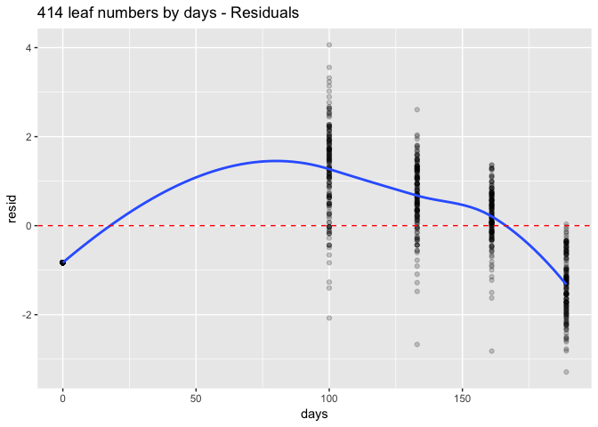

# 414 F2 Growth data_transformed


Exploring 414 F2 growth data
- Summarizing and trying to set up growth models through transforming data set


```r
load("414 F2 Growth data.RData")
```

### Leaf lobe phenotypes

(These are measured from leaves 5 and 8.  Shinje says these are always the same).

Criteria: at least 1cm long and when you fold it over touches petiole.

Important for distinguishing different varieties (patent, etc).

Characteristics of Plants Before Flowering
Leaf—development of lobes: The leaves on the upper portion of the stem can show varying degrees of development of lobes which are disconnected from one another along the petiole of the leaf. The degree of lobing is variety specific and can range from absent (no lobes)/weak through very strong (abundant lobes).
(US Patent US6489543)

Generally hight height number is good for drought tolerance.  Good for winter.  Not usually needed for summer, but good for summer in Mongolia.


```r
lobes.transformed <- lobes %>% mutate(lobe_number_log=log(lobe_number+1), lobe_number_sqrt=sqrt(lobe_number+1), lobe_number_croot= sign(lobe_number)*abs(lobe_number+1)^(1/3))
head(lobes.transformed)
```

```
## # A tibble: 6 × 6
##      ID     days lobe_number lobe_number_log lobe_number_sqrt
##   <chr>   <time>       <dbl>           <dbl>            <dbl>
## 1  ID_1 110 days           0        0.000000         1.000000
## 2  ID_2 110 days           0        0.000000         1.000000
## 3  ID_3 110 days           0        0.000000         1.000000
## 4  ID_4 110 days           9        2.302585         3.162278
## 5  ID_6 110 days           0        0.000000         1.000000
## 6  ID_7 110 days           0        0.000000         1.000000
## # ... with 1 more variables: lobe_number_croot <dbl>
```

```r
sapply(colnames(lobes.transformed)[3:6], function(x)  summary(lobes.transformed[,x])) 
```

```
##      lobe_number        lobe_number_log   lobe_number_sqrt 
## [1,] "Min.   : 0.000  " "Min.   :0.000  " "Min.   :1.000  "
## [2,] "1st Qu.: 0.000  " "1st Qu.:0.000  " "1st Qu.:1.000  "
## [3,] "Median : 7.000  " "Median :2.079  " "Median :2.828  "
## [4,] "Mean   : 6.548  " "Mean   :1.562  " "Mean   :2.500  "
## [5,] "3rd Qu.:11.000  " "3rd Qu.:2.485  " "3rd Qu.:3.464  "
## [6,] "Max.   :21.000  " "Max.   :3.091  " "Max.   :4.690  "
##      lobe_number_croot
## [1,] "Min.   :0.000  "
## [2,] "1st Qu.:0.000  "
## [3,] "Median :2.000  "
## [4,] "Mean   :1.492  "
## [5,] "3rd Qu.:2.289  "
## [6,] "Max.   :2.802  "
```

```r
#tmp <- list()
#for (i in colnames(lobes.transformed)[3:6]) {
#  tmp[[i]] <- summary(lobes.transformed[,i])
#}
#tmp
```
##### predictions

```r
lobe.num.mod <- lm(lobe_number ~ days, data = lobes.transformed)
summary(lobe.num.mod)
```

```
## 
## Call:
## lm(formula = lobe_number ~ days, data = lobes.transformed)
## 
## Residuals:
##    Min     1Q Median     3Q    Max 
## -8.063 -2.104 -1.104  1.937 15.472 
## 
## Coefficients:
##               Estimate Std. Error t value Pr(>|t|)    
## (Intercept) -12.390979   0.713804  -17.36   <2e-16 ***
## days          0.126261   0.004658   27.11   <2e-16 ***
## ---
## Signif. codes:  0 '***' 0.001 '**' 0.01 '*' 0.05 '.' 0.1 ' ' 1
## 
## Residual standard error: 3.765 on 662 degrees of freedom
## Multiple R-squared:  0.5261,	Adjusted R-squared:  0.5253 
## F-statistic: 734.8 on 1 and 662 DF,  p-value: < 2.2e-16
```

```r
lobe.log.mod <- lm(lobe_number_log ~ days, data = lobes.transformed)
summary(lobe.log.mod)
```

```
## 
## Call:
## lm(formula = lobe_number_log ~ days, data = lobes.transformed)
## 
## Residuals:
##     Min      1Q  Median      3Q     Max 
## -1.8742 -0.5223 -0.1411  0.5763  2.1857 
## 
## Coefficients:
##               Estimate Std. Error t value Pr(>|t|)    
## (Intercept) -2.3372959  0.1428611  -16.36   <2e-16 ***
## days         0.0259966  0.0009322   27.89   <2e-16 ***
## ---
## Signif. codes:  0 '***' 0.001 '**' 0.01 '*' 0.05 '.' 0.1 ' ' 1
## 
## Residual standard error: 0.7535 on 662 degrees of freedom
## Multiple R-squared:  0.5402,	Adjusted R-squared:  0.5395 
## F-statistic: 777.6 on 1 and 662 DF,  p-value: < 2.2e-16
```

```r
lobe.sqrt.mod <- lm(lobe_number_sqrt ~ days, data = lobes.transformed)
summary(lobe.sqrt.mod)
```

```
## 
## Call:
## lm(formula = lobe_number_sqrt ~ days, data = lobes.transformed)
## 
## Residuals:
##      Min       1Q   Median       3Q      Max 
## -1.82370 -0.42226 -0.08057  0.49293  2.51350 
## 
## Coefficients:
##               Estimate Std. Error t value Pr(>|t|)    
## (Intercept) -1.5423308  0.1448539  -10.65   <2e-16 ***
## days         0.0269508  0.0009452   28.51   <2e-16 ***
## ---
## Signif. codes:  0 '***' 0.001 '**' 0.01 '*' 0.05 '.' 0.1 ' ' 1
## 
## Residual standard error: 0.7641 on 662 degrees of freedom
## Multiple R-squared:  0.5512,	Adjusted R-squared:  0.5505 
## F-statistic: 812.9 on 1 and 662 DF,  p-value: < 2.2e-16
```

```r
lobe.croot.mod <- lm(lobe_number_croot ~ days, data = lobes.transformed)
summary(lobe.croot.mod)
```

```
## 
## Call:
## lm(formula = lobe_number_croot ~ days, data = lobes.transformed)
## 
## Residuals:
##     Min      1Q  Median      3Q     Max 
## -1.7676 -0.5726 -0.0928  0.5837  1.8936 
## 
## Coefficients:
##               Estimate Std. Error t value Pr(>|t|)    
## (Intercept) -1.9551840  0.1359867  -14.38   <2e-16 ***
## days         0.0229801  0.0008874   25.90   <2e-16 ***
## ---
## Signif. codes:  0 '***' 0.001 '**' 0.01 '*' 0.05 '.' 0.1 ' ' 1
## 
## Residual standard error: 0.7173 on 662 degrees of freedom
## Multiple R-squared:  0.5032,	Adjusted R-squared:  0.5025 
## F-statistic: 670.6 on 1 and 662 DF,  p-value: < 2.2e-16
```

```r
predicted <- function(mods, transforms) {
lobes.transformed %>% 
   add_predictions(mods) %>%
   ggplot() +
   geom_line(aes(x=days, y = pred), colour = "red", size = 0.5) +
   geom_line(aes(x=days, y=transforms, group=ID), alpha=.1) +
   ggtitle("414 lobe numbers by days - Prediction")
}

predicted(lobe.num.mod, lobes.transformed$lobe_number)
```

```
## Don't know how to automatically pick scale for object of type difftime. Defaulting to continuous.
```

<!-- -->

```r
predicted(lobe.log.mod, lobes.transformed$lobe_number_log)
```

```
## Don't know how to automatically pick scale for object of type difftime. Defaulting to continuous.
```

<!-- -->

```r
predicted(lobe.sqrt.mod, lobes.transformed$lobe_number_sqrt)
```

```
## Don't know how to automatically pick scale for object of type difftime. Defaulting to continuous.
```

<!-- -->

```r
predicted(lobe.croot.mod, lobes.transformed$lobe_number_croot)
```

```
## Don't know how to automatically pick scale for object of type difftime. Defaulting to continuous.
```

<!-- -->
##### residuals

```r
residual <- function (mods) {
lobes.transformed %>%
  add_residuals(mods) %>%
  ggplot(aes(days, resid)) +
  geom_point(alpha=0.2) +
  geom_smooth(se = FALSE) +
  geom_hline(yintercept = 0, colour = "red", linetype =2, size = 0.5) +
  ggtitle("414 lobe numbers by days - Residuals")
}

residual(lobe.num.mod)
```

```
## Don't know how to automatically pick scale for object of type difftime. Defaulting to continuous.
```

```
## `geom_smooth()` using method = 'loess'
```

```
## Warning in simpleLoess(y, x, w, span, degree = degree, parametric =
## parametric, : pseudoinverse used at 109.58
```

```
## Warning in simpleLoess(y, x, w, span, degree = degree, parametric =
## parametric, : neighborhood radius 52.42
```

```
## Warning in simpleLoess(y, x, w, span, degree = degree, parametric =
## parametric, : reciprocal condition number 1.657e-15
```

```
## Warning in simpleLoess(y, x, w, span, degree = degree, parametric =
## parametric, : There are other near singularities as well. 3650.6
```

<!-- -->

```r
residual(lobe.log.mod)
```

```
## Don't know how to automatically pick scale for object of type difftime. Defaulting to continuous.
## `geom_smooth()` using method = 'loess'
```

```
## Warning in simpleLoess(y, x, w, span, degree = degree, parametric =
## parametric, : pseudoinverse used at 109.58
```

```
## Warning in simpleLoess(y, x, w, span, degree = degree, parametric =
## parametric, : neighborhood radius 52.42
```

```
## Warning in simpleLoess(y, x, w, span, degree = degree, parametric =
## parametric, : reciprocal condition number 1.657e-15
```

```
## Warning in simpleLoess(y, x, w, span, degree = degree, parametric =
## parametric, : There are other near singularities as well. 3650.6
```

<!-- -->

```r
residual(lobe.sqrt.mod)
```

```
## Don't know how to automatically pick scale for object of type difftime. Defaulting to continuous.
## `geom_smooth()` using method = 'loess'
```

```
## Warning in simpleLoess(y, x, w, span, degree = degree, parametric =
## parametric, : pseudoinverse used at 109.58
```

```
## Warning in simpleLoess(y, x, w, span, degree = degree, parametric =
## parametric, : neighborhood radius 52.42
```

```
## Warning in simpleLoess(y, x, w, span, degree = degree, parametric =
## parametric, : reciprocal condition number 1.657e-15
```

```
## Warning in simpleLoess(y, x, w, span, degree = degree, parametric =
## parametric, : There are other near singularities as well. 3650.6
```

<!-- -->

```r
residual(lobe.croot.mod)
```

```
## Don't know how to automatically pick scale for object of type difftime. Defaulting to continuous.
## `geom_smooth()` using method = 'loess'
```

```
## Warning in simpleLoess(y, x, w, span, degree = degree, parametric =
## parametric, : pseudoinverse used at 109.58
```

```
## Warning in simpleLoess(y, x, w, span, degree = degree, parametric =
## parametric, : neighborhood radius 52.42
```

```
## Warning in simpleLoess(y, x, w, span, degree = degree, parametric =
## parametric, : reciprocal condition number 1.657e-15
```

```
## Warning in simpleLoess(y, x, w, span, degree = degree, parametric =
## parametric, : There are other near singularities as well. 3650.6
```

<!-- -->

After transforming the data, R-squared values didn't get changed a lot and the distribution of noises at the residual plots got worse.

### Leaf number phenotypes


```r
leafs.transformed <- leafs %>% mutate(leaf_number_log=log(leaf_number+1), leaf_number_sqrt=sqrt(leaf_number), leaf_number_croot= sign(leaf_number)*abs(leaf_number)^(1/3))
head(leafs.transformed)
```

```
## # A tibble: 6 × 6
##      ID     days leaf_number leaf_number_log leaf_number_sqrt
##   <chr>   <time>       <dbl>           <dbl>            <dbl>
## 1  ID_1 110 days          24        3.218876         4.898979
## 2  ID_2 110 days          19        2.995732         4.358899
## 3  ID_3 110 days          15        2.772589         3.872983
## 4  ID_4 110 days          22        3.135494         4.690416
## 5  ID_6 110 days          13        2.639057         3.605551
## 6  ID_7 110 days          21        3.091042         4.582576
## # ... with 1 more variables: leaf_number_croot <dbl>
```

```r
sapply(colnames(leafs.transformed)[3:6], function(x)  summary(leafs.transformed[,x])) 
```

```
##      leaf_number       leaf_number_log    leaf_number_sqrt 
## [1,] "Min.   : 1.00  " "Min.   :0.6931  " "Min.   :1.000  "
## [2,] "1st Qu.: 7.00  " "1st Qu.:2.0794  " "1st Qu.:2.646  "
## [3,] "Median :12.00  " "Median :2.5649  " "Median :3.464  "
## [4,] "Mean   :12.54  " "Mean   :2.4772  " "Mean   :3.415  "
## [5,] "3rd Qu.:18.00  " "3rd Qu.:2.9444  " "3rd Qu.:4.243  "
## [6,] "Max.   :31.00  " "Max.   :3.4657  " "Max.   :5.568  "
##      leaf_number_croot
## [1,] "Min.   :1.000  "
## [2,] "1st Qu.:1.913  "
## [3,] "Median :2.289  "
## [4,] "Mean   :2.247  "
## [5,] "3rd Qu.:2.621  "
## [6,] "Max.   :3.141  "
```

##### predictions

```r
leaf.num.mod <- lm(leaf_number ~ days, data = leafs.transformed)
summary(leaf.num.mod)
```

```
## 
## Call:
## lm(formula = leaf_number ~ days, data = leafs.transformed)
## 
## Residuals:
##      Min       1Q   Median       3Q      Max 
## -14.3452  -3.2494   0.5393   3.5393  16.5393 
## 
## Coefficients:
##             Estimate Std. Error t value Pr(>|t|)    
## (Intercept) 30.56586    0.94698   32.28   <2e-16 ***
## days        -0.12019    0.00618  -19.45   <2e-16 ***
## ---
## Signif. codes:  0 '***' 0.001 '**' 0.01 '*' 0.05 '.' 0.1 ' ' 1
## 
## Residual standard error: 4.995 on 662 degrees of freedom
## Multiple R-squared:  0.3636,	Adjusted R-squared:  0.3627 
## F-statistic: 378.3 on 1 and 662 DF,  p-value: < 2.2e-16
```

```r
leaf.log.mod <- lm(leaf_number_log ~ days, data = leafs.transformed)
summary(leaf.log.mod)
```

```
## 
## Call:
## lm(formula = leaf_number_log ~ days, data = leafs.transformed)
## 
## Residuals:
##      Min       1Q   Median       3Q      Max 
## -1.66947 -0.23200  0.08544  0.31906  0.98737 
## 
## Coefficients:
##               Estimate Std. Error t value Pr(>|t|)    
## (Intercept)  3.9090332  0.0856964   45.62   <2e-16 ***
## days        -0.0095458  0.0005592  -17.07   <2e-16 ***
## ---
## Signif. codes:  0 '***' 0.001 '**' 0.01 '*' 0.05 '.' 0.1 ' ' 1
## 
## Residual standard error: 0.452 on 662 degrees of freedom
## Multiple R-squared:  0.3056,	Adjusted R-squared:  0.3046 
## F-statistic: 291.4 on 1 and 662 DF,  p-value: < 2.2e-16
```

```r
leaf.sqrt.mod <- lm(leaf_number_sqrt ~ days, data = leafs.transformed)
summary(leaf.sqrt.mod)
```

```
## 
## Call:
## lm(formula = leaf_number_sqrt ~ days, data = leafs.transformed)
## 
## Residuals:
##     Min      1Q  Median      3Q     Max 
## -2.3794 -0.4369  0.1312  0.5350  1.8739 
## 
## Coefficients:
##              Estimate Std. Error t value Pr(>|t|)    
## (Intercept)  6.025245   0.143895   41.87   <2e-16 ***
## days        -0.017399   0.000939  -18.53   <2e-16 ***
## ---
## Signif. codes:  0 '***' 0.001 '**' 0.01 '*' 0.05 '.' 0.1 ' ' 1
## 
## Residual standard error: 0.759 on 662 degrees of freedom
## Multiple R-squared:  0.3415,	Adjusted R-squared:  0.3405 
## F-statistic: 343.3 on 1 and 662 DF,  p-value: < 2.2e-16
```

```r
leaf.croot.mod <- lm(leaf_number_croot ~ days, data = leafs.transformed)
summary(leaf.croot.mod)
```

```
## 
## Call:
## lm(formula = leaf_number_croot ~ days, data = leafs.transformed)
## 
## Residuals:
##      Min       1Q   Median       3Q      Max 
## -1.15439 -0.19876  0.06307  0.24822  0.80821 
## 
## Coefficients:
##               Estimate Std. Error t value Pr(>|t|)    
## (Intercept)  3.4107766  0.0662434   51.49   <2e-16 ***
## days        -0.0077555  0.0004323  -17.94   <2e-16 ***
## ---
## Signif. codes:  0 '***' 0.001 '**' 0.01 '*' 0.05 '.' 0.1 ' ' 1
## 
## Residual standard error: 0.3494 on 662 degrees of freedom
## Multiple R-squared:  0.3272,	Adjusted R-squared:  0.3261 
## F-statistic: 321.9 on 1 and 662 DF,  p-value: < 2.2e-16
```

```r
predicted <- function(mods, transforms) {
lobes.transformed %>% 
   add_predictions(mods) %>%
   ggplot() +
   geom_line(aes(x=days, y = pred), colour = "red", size = 0.5) +
   geom_line(aes(x=days, y=transforms, group=ID), alpha=.1) +
   ggtitle("414 lobe numbers by days - Prediction")
}

predicted(leaf.num.mod, leafs.transformed$leaf_number)
```

```
## Don't know how to automatically pick scale for object of type difftime. Defaulting to continuous.
```

<!-- -->

```r
predicted(leaf.log.mod, leafs.transformed$leaf_number_log)
```

```
## Don't know how to automatically pick scale for object of type difftime. Defaulting to continuous.
```

<!-- -->

```r
predicted(leaf.sqrt.mod, leafs.transformed$leaf_number_sqrt)
```

```
## Don't know how to automatically pick scale for object of type difftime. Defaulting to continuous.
```

<!-- -->

```r
predicted(leaf.croot.mod, leafs.transformed$leaf_number_croot)
```

```
## Don't know how to automatically pick scale for object of type difftime. Defaulting to continuous.
```

<!-- -->

##### residuals

```r
residual <- function (mods) {
leafs.transformed %>%
  add_residuals(mods) %>%
  ggplot(aes(days, resid)) +
  geom_point(alpha=0.2) +
  geom_smooth(se = FALSE) +
  geom_hline(yintercept = 0, colour = "red", linetype =2, size = 0.5) +
  ggtitle("414 leaf numbers by days - Residuals")
}

residual(leaf.num.mod)
```

```
## Don't know how to automatically pick scale for object of type difftime. Defaulting to continuous.
```

```
## `geom_smooth()` using method = 'loess'
```

```
## Warning in simpleLoess(y, x, w, span, degree = degree, parametric =
## parametric, : pseudoinverse used at 109.58
```

```
## Warning in simpleLoess(y, x, w, span, degree = degree, parametric =
## parametric, : neighborhood radius 52.42
```

```
## Warning in simpleLoess(y, x, w, span, degree = degree, parametric =
## parametric, : reciprocal condition number 1.657e-15
```

```
## Warning in simpleLoess(y, x, w, span, degree = degree, parametric =
## parametric, : There are other near singularities as well. 3650.6
```

<!-- -->

```r
residual(leaf.log.mod)
```

```
## Don't know how to automatically pick scale for object of type difftime. Defaulting to continuous.
## `geom_smooth()` using method = 'loess'
```

```
## Warning in simpleLoess(y, x, w, span, degree = degree, parametric =
## parametric, : pseudoinverse used at 109.58
```

```
## Warning in simpleLoess(y, x, w, span, degree = degree, parametric =
## parametric, : neighborhood radius 52.42
```

```
## Warning in simpleLoess(y, x, w, span, degree = degree, parametric =
## parametric, : reciprocal condition number 1.657e-15
```

```
## Warning in simpleLoess(y, x, w, span, degree = degree, parametric =
## parametric, : There are other near singularities as well. 3650.6
```

<!-- -->

```r
residual(leaf.sqrt.mod)
```

```
## Don't know how to automatically pick scale for object of type difftime. Defaulting to continuous.
## `geom_smooth()` using method = 'loess'
```

```
## Warning in simpleLoess(y, x, w, span, degree = degree, parametric =
## parametric, : pseudoinverse used at 109.58
```

```
## Warning in simpleLoess(y, x, w, span, degree = degree, parametric =
## parametric, : neighborhood radius 52.42
```

```
## Warning in simpleLoess(y, x, w, span, degree = degree, parametric =
## parametric, : reciprocal condition number 1.657e-15
```

```
## Warning in simpleLoess(y, x, w, span, degree = degree, parametric =
## parametric, : There are other near singularities as well. 3650.6
```

<!-- -->

```r
residual(leaf.croot.mod)
```

```
## Don't know how to automatically pick scale for object of type difftime. Defaulting to continuous.
## `geom_smooth()` using method = 'loess'
```

```
## Warning in simpleLoess(y, x, w, span, degree = degree, parametric =
## parametric, : pseudoinverse used at 109.58
```

```
## Warning in simpleLoess(y, x, w, span, degree = degree, parametric =
## parametric, : neighborhood radius 52.42
```

```
## Warning in simpleLoess(y, x, w, span, degree = degree, parametric =
## parametric, : reciprocal condition number 1.657e-15
```

```
## Warning in simpleLoess(y, x, w, span, degree = degree, parametric =
## parametric, : There are other near singularities as well. 3650.6
```

<!-- -->

After transforming the data, the R-squared values and the noise distribution on the remaining plots did not change.


## Plant height phenotypes


```r
heights.transformed <- heights0 %>% mutate(height_log=log(height+1), height_sqrt=sqrt(height), height_croot= sign(height)*abs(height)^(1/3))
head(heights.transformed)
```

```
##     ID days height height_log height_sqrt height_croot
## 1 ID_1    0      0          0           0            0
## 2 ID_2    0      0          0           0            0
## 3 ID_3    0      0          0           0            0
## 4 ID_4    0      0          0           0            0
## 5 ID_6    0      0          0           0            0
## 6 ID_7    0      0          0           0            0
```

```r
summary(heights.transformed$height)
```

```
##    Min. 1st Qu.  Median    Mean 3rd Qu.    Max. 
##    0.00   15.00   55.00   77.46  138.00  229.00
```

```r
summary(heights.transformed$height_log)
```

```
##    Min. 1st Qu.  Median    Mean 3rd Qu.    Max. 
##   0.000   2.773   4.025   3.528   4.934   5.438
```

```r
summary(heights.transformed$height_sqrt)
```

```
##    Min. 1st Qu.  Median    Mean 3rd Qu.    Max. 
##   0.000   3.873   7.416   7.497  11.747  15.133
```

```r
summary(heights.transformed$height_croot)
```

```
##    Min. 1st Qu.  Median    Mean 3rd Qu.    Max. 
##   0.000   2.466   3.803   3.538   5.168   6.118
```

##### predictions

```r
height.mod <- lm(height ~ days, data = heights.transformed)
summary(height.mod)
```

```
## 
## Call:
## lm(formula = height ~ days, data = heights.transformed)
## 
## Residuals:
##     Min      1Q  Median      3Q     Max 
## -85.482 -31.391   5.579  25.682  78.763 
## 
## Coefficients:
##              Estimate Std. Error t value Pr(>|t|)    
## (Intercept) -25.68221    2.01856  -12.72   <2e-16 ***
## days          0.74561    0.01275   58.47   <2e-16 ***
## ---
## Signif. codes:  0 '***' 0.001 '**' 0.01 '*' 0.05 '.' 0.1 ' ' 1
## 
## Residual standard error: 30.97 on 994 degrees of freedom
## Multiple R-squared:  0.7747,	Adjusted R-squared:  0.7745 
## F-statistic:  3419 on 1 and 994 DF,  p-value: < 2.2e-16
```

```r
height.log.mod <- lm(height_log ~ days, data = heights.transformed)
summary(height.log.mod)
```

```
## 
## Call:
## lm(formula = height_log ~ days, data = heights.transformed)
## 
## Residuals:
##     Min      1Q  Median      3Q     Max 
## -1.6050 -0.4971  0.1441  0.3954  1.3845 
## 
## Coefficients:
##              Estimate Std. Error t value Pr(>|t|)    
## (Intercept) 0.4971275  0.0353973   14.04   <2e-16 ***
## days        0.0219109  0.0002236   97.98   <2e-16 ***
## ---
## Signif. codes:  0 '***' 0.001 '**' 0.01 '*' 0.05 '.' 0.1 ' ' 1
## 
## Residual standard error: 0.543 on 994 degrees of freedom
## Multiple R-squared:  0.9062,	Adjusted R-squared:  0.9061 
## F-statistic:  9601 on 1 and 994 DF,  p-value: < 2.2e-16
```

```r
height.sqrt.mod <- lm(height_sqrt ~ days, data = heights.transformed)
summary(height.sqrt.mod)
```

```
## 
## Call:
## lm(formula = height_sqrt ~ days, data = heights.transformed)
## 
## Residuals:
##     Min      1Q  Median      3Q     Max 
## -5.1415 -1.0714  0.0348  0.8409  3.7611 
## 
## Coefficients:
##               Estimate Std. Error t value Pr(>|t|)    
## (Intercept) -0.3807797  0.0934738  -4.074    5e-05 ***
## days         0.0569485  0.0005905  96.439   <2e-16 ***
## ---
## Signif. codes:  0 '***' 0.001 '**' 0.01 '*' 0.05 '.' 0.1 ' ' 1
## 
## Residual standard error: 1.434 on 994 degrees of freedom
## Multiple R-squared:  0.9034,	Adjusted R-squared:  0.9033 
## F-statistic:  9301 on 1 and 994 DF,  p-value: < 2.2e-16
```

```r
height.croot.mod <- lm(height_croot ~ days, data = heights.transformed)
summary(height.croot.mod)
```

```
## 
## Call:
## lm(formula = height_croot ~ days, data = heights.transformed)
## 
## Residuals:
##     Min      1Q  Median      3Q     Max 
## -1.9428 -0.2487 -0.1068  0.3743  1.5211 
## 
## Coefficients:
##              Estimate Std. Error t value Pr(>|t|)    
## (Intercept) 0.2487177  0.0335273   7.418 2.54e-13 ***
## days        0.0237791  0.0002118 112.269  < 2e-16 ***
## ---
## Signif. codes:  0 '***' 0.001 '**' 0.01 '*' 0.05 '.' 0.1 ' ' 1
## 
## Residual standard error: 0.5143 on 994 degrees of freedom
## Multiple R-squared:  0.9269,	Adjusted R-squared:  0.9268 
## F-statistic: 1.26e+04 on 1 and 994 DF,  p-value: < 2.2e-16
```

```r
predicted <- function(mods, transforms) {
heights.transformed %>% 
  add_predictions(mods) %>%
  ggplot() +
  geom_line(aes(x=days, y = pred), colour = "red", size = 0.5) +
  geom_line(aes(x=days, y=transforms, group=ID), alpha=.1) +
  ggtitle("414 height by days - Prediction")
}

predicted(height.mod, heights.transformed$height)
```

<!-- -->

```r
predicted(height.log.mod, heights.transformed$height_log)
```

<!-- -->

```r
predicted(height.sqrt.mod, heights.transformed$height_sqrt)
```

<!-- -->

```r
predicted(height.croot.mod, heights.transformed$height_croot)
```

<!-- -->

##### residuals

```r
residual <- function (mods) {
heights.transformed %>%
  add_residuals(mods) %>%
  ggplot(aes(days, resid)) +
  geom_point(alpha=0.2) +
  geom_smooth(se = FALSE) +
  geom_hline(yintercept = 0, colour = "red", linetype =2, size = 0.5) +
  ggtitle("414 leaf numbers by days - Residuals")
}

residual(height.mod)
```

```
## `geom_smooth()` using method = 'loess'
```

<!-- -->

```r
residual(height.log.mod)
```

```
## `geom_smooth()` using method = 'loess'
```

<!-- -->

```r
residual(height.sqrt.mod)
```

```
## `geom_smooth()` using method = 'loess'
```

<!-- -->

```r
residual(height.croot.mod)
```

```
## `geom_smooth()` using method = 'loess'
```

<!-- -->

After including the data of days=0 and height=0, the R = squared value got higher but the noise was still not randomly distributed in the residual plots.
By transforming the data the R = squared value got higher but the noise was still not randomly distributed in the residual plots.

### Plant width phenotypes


```r
widths.transformed <- widths0 %>% mutate(width_log=log10(width+1), width_sqrt=sqrt(width), width_croot= sign(width)*abs(width)^(1/3))
head(widths.transformed)
```

```
##     ID days width width_log width_sqrt width_croot
## 1 ID_1    0     0         0          0           0
## 2 ID_2    0     0         0          0           0
## 3 ID_3    0     0         0          0           0
## 4 ID_4    0     0         0          0           0
## 5 ID_6    0     0         0          0           0
## 6 ID_7    0     0         0          0           0
```

```r
summary(widths.transformed$width)
```

```
##    Min. 1st Qu.  Median    Mean 3rd Qu.    Max. 
##     0.0    31.0    49.5    42.5    60.0    83.5
```

```r
summary(widths.transformed$width_log)
```

```
##    Min. 1st Qu.  Median    Mean 3rd Qu.    Max. 
##   0.000   1.505   1.703   1.375   1.785   1.927
```

```r
summary(widths.transformed$width_sqrt)
```

```
##    Min. 1st Qu.  Median    Mean 3rd Qu.    Max. 
##   0.000   5.568   7.036   5.781   7.746   9.138
```

```r
summary(widths.transformed$width_croot)
```

```
##    Min. 1st Qu.  Median    Mean 3rd Qu.    Max. 
##   0.000   3.141   3.672   2.984   3.915   4.371
```

# predictions

```r
width.mod <- lm(width ~ days, data = widths.transformed)
summary(width.mod)
```

```
## 
## Call:
## lm(formula = width ~ days, data = widths.transformed)
## 
## Residuals:
##     Min      1Q  Median      3Q     Max 
## -35.472  -4.472  -1.598   7.301  46.502 
## 
## Coefficients:
##             Estimate Std. Error t value Pr(>|t|)    
## (Intercept) 3.880417   0.777469   4.991 7.32e-07 ***
## days        0.331173   0.005817  56.936  < 2e-16 ***
## ---
## Signif. codes:  0 '***' 0.001 '**' 0.01 '*' 0.05 '.' 0.1 ' ' 1
## 
## Residual standard error: 10.95 on 828 degrees of freedom
## Multiple R-squared:  0.7965,	Adjusted R-squared:  0.7963 
## F-statistic:  3242 on 1 and 828 DF,  p-value: < 2.2e-16
```

```r
width.log.mod <- lm(width_log ~ days, data = widths.transformed)
summary(width.log.mod)
```

```
## 
## Call:
## lm(formula = width_log ~ days, data = widths.transformed)
## 
## Residuals:
##      Min       1Q   Median       3Q      Max 
## -0.57630 -0.23607 -0.01567  0.21641  0.71439 
## 
## Coefficients:
##              Estimate Std. Error t value Pr(>|t|)    
## (Intercept) 0.2360699  0.0197347   11.96   <2e-16 ***
## days        0.0097639  0.0001476   66.13   <2e-16 ***
## ---
## Signif. codes:  0 '***' 0.001 '**' 0.01 '*' 0.05 '.' 0.1 ' ' 1
## 
## Residual standard error: 0.278 on 828 degrees of freedom
## Multiple R-squared:  0.8408,	Adjusted R-squared:  0.8406 
## F-statistic:  4373 on 1 and 828 DF,  p-value: < 2.2e-16
```

```r
width.sqrt.mod <- lm(width_sqrt ~ days, data = widths.transformed)
summary(width.sqrt.mod)
```

```
## 
## Call:
## lm(formula = width_sqrt ~ days, data = widths.transformed)
## 
## Residuals:
##     Min      1Q  Median      3Q     Max 
## -3.2877 -0.8291 -0.0782  0.8483  4.0620 
## 
## Coefficients:
##              Estimate Std. Error t value Pr(>|t|)    
## (Intercept) 0.8290980  0.0833475   9.947   <2e-16 ***
## days        0.0424678  0.0006236  68.106   <2e-16 ***
## ---
## Signif. codes:  0 '***' 0.001 '**' 0.01 '*' 0.05 '.' 0.1 ' ' 1
## 
## Residual standard error: 1.174 on 828 degrees of freedom
## Multiple R-squared:  0.8485,	Adjusted R-squared:  0.8483 
## F-statistic:  4638 on 1 and 828 DF,  p-value: < 2.2e-16
```

```r
width.croot.mod <- lm(width_croot ~ days, data = widths.transformed)
summary(width.croot.mod)
```

```
## 
## Call:
## lm(formula = width_croot ~ days, data = widths.transformed)
## 
## Residuals:
##     Min      1Q  Median      3Q     Max 
## -1.3941 -0.4852 -0.0206  0.4531  1.7426 
## 
## Coefficients:
##              Estimate Std. Error t value Pr(>|t|)    
## (Intercept) 0.4852418  0.0423564   11.46   <2e-16 ***
## days        0.0214300  0.0003169   67.63   <2e-16 ***
## ---
## Signif. codes:  0 '***' 0.001 '**' 0.01 '*' 0.05 '.' 0.1 ' ' 1
## 
## Residual standard error: 0.5966 on 828 degrees of freedom
## Multiple R-squared:  0.8467,	Adjusted R-squared:  0.8465 
## F-statistic:  4573 on 1 and 828 DF,  p-value: < 2.2e-16
```

```r
predicted <- function(mods, transforms) {
widths.transformed %>% 
  add_predictions(mods) %>%
  ggplot() +
  geom_line(aes(x=days, y = pred), colour = "red", size = 0.5) +
  geom_line(aes(x=days, y=transforms, group=ID), alpha=.1) +
  ggtitle("414 width by days - Prediction")
}

predicted(width.mod, widths.transformed$width)
```

<!-- -->

```r
predicted(width.log.mod, widths.transformed$width_log)
```

<!-- -->

```r
predicted(width.sqrt.mod, widths.transformed$width_sqrt)
```

<!-- -->

```r
predicted(width.croot.mod, widths.transformed$width_croot)
```

<!-- -->

# Residuals

```r
residual <- function (mods) {
widths.transformed %>%
  add_residuals(mods) %>%
  ggplot(aes(days, resid)) +
  geom_point(alpha=0.2) +
  geom_smooth(se = FALSE) +
  geom_hline(yintercept = 0, colour = "red", linetype =2, size = 0.5) +
  ggtitle("414 leaf numbers by days - Residuals")
}

residual(width.mod)
```

```
## `geom_smooth()` using method = 'loess'
```

<!-- -->

```r
residual(width.log.mod)
```

```
## `geom_smooth()` using method = 'loess'
```

<!-- -->

```r
residual(width.sqrt.mod)
```

```
## `geom_smooth()` using method = 'loess'
```

<!-- -->

```r
residual(width.croot.mod)
```

```
## `geom_smooth()` using method = 'loess'
```

<!-- -->

By including the data of days=0 and width=0, R-squared values got dramatically increased but distribution of noises got worse in the residual plot. However, untransformed data set showed quite random distribution of noises at residual plot.


